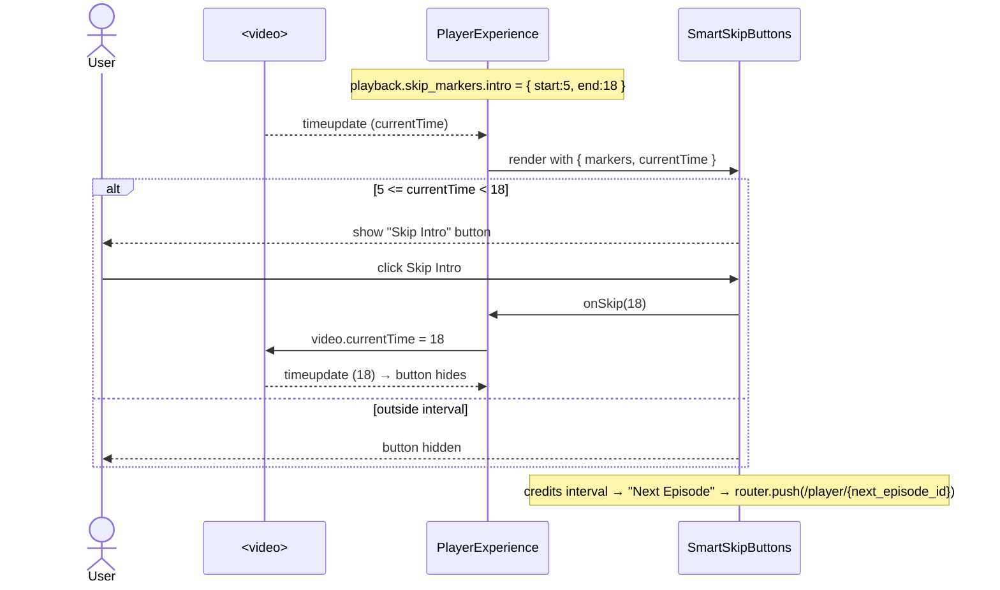

# Design Document

## Overview

Phase 2 adds two routes — `/watch/[id]` (title detail) and `/player/[id]` (custom HLS player) — plus the backend data to power them. It reuses the Phase-1 stack end to end: Next.js 15 App Router, TypeScript, Tailwind tokens, Framer Motion, TanStack Query, Zustand, and the FastAPI + SQLite catalog. **The only new dependency is `hls.js`.** The Phase-1 homepage and its components are frozen; Phase 2 only adds new files and new backend columns/tables/endpoints.

Two new shared, visually-identical-to-home building blocks (`PosterCard`, `PosterRow`) are introduced in `shared/` so the watch page can show "More Like This" rows **without importing `features/home` internals and without modifying the homepage**. (See Design Decisions.)

## Architecture

### At a glance

```
Browser
  ├─ /watch/[id]  (server shell) → WatchExperience (client)
  │     React Query: detail, reviews, episodes, similar
  │     → WatchBanner, WatchActions, TrailersRow, CastRow, EpisodeList,
  │       RelatedRows, Reviews, ContentInfoPanel
  │
  └─ /player/[id] (server shell) → PlayerExperience (client)
        React Query: playback   |  Zustand(persist): player prefs
        useHlsPlayer (hls.js)   |  local useReducer: transient playback state
        → VideoSurface, TopBar, ControlBar(ScrubBar, SettingsMenu),
          SmartSkipButtons, PlayerError

FastAPI /api/v1
  ├─ GET  /content/{id}                 (extended: trailers, cast, content_info, rating_breakdown)
  ├─ GET  /content/{id}/reviews         (breakdown + items, sortable)
  ├─ POST /content/{id}/reviews/{rid}/vote
  ├─ GET  /content/{id}/playback        (hls_url, renditions, audio/subtitle tracks, skip markers, next ep)
  └─ GET  /content/{id}/episodes        (seasons → episodes)

SQLite: content (new JSON columns) + reviews table + episodes table
```

---

## Components and Interfaces

### Component Tree — `/watch/[id]`

`app/watch/[id]/page.tsx` is a thin **server component** that reads the `id` param and renders the client orchestrator. Everything interactive is a client component, mounted inside the existing `AppShell` (navbar + sidebar + footer) via the root layout.

```
app/watch/[id]/page.tsx                         (server) → <WatchExperience id={params.id} />
└─ features/watch/WatchExperience.tsx           (client orchestrator)
   props: { id: string }
   data:  useTitleDetail(id), useAuthGuard()
   ├─ <AuthGate/>                               redirect to /login if unauthenticated (lenient in dev)
   ├─ <WatchBanner title={detail}/>
   │     props: { title: TitleDetail }
   │     renders poster/gradient, color-matched blurred backdrop, title,
   │     badges (year, maturity, duration, top quality), ratings
   ├─ <WatchActions title={detail}/>
   │     props: { title: TitleDetail }
   │     Play → router.push(`/player/${id}`); Watchlist → useMyList.toggle;
   │     Share → navigator.clipboard; Download (premium-gated visual)
   ├─ <SynopsisBlock text={detail.synopsis}/>
   │     props: { text: string; clampLines?: number }  (expand/collapse)
   ├─ <TrailersRow trailers={detail.trailers}/>
   │     props: { trailers: Trailer[] }
   │     └─ <InlineTrailerPlayer trailer onClose/>   props: { trailer: Trailer; onClose: ()=>void }
   ├─ <CastRow cast={detail.cast} onSelect={setPerson}/>
   │     props: { cast: CastMember[]; onSelect: (m: CastMember)=>void }
   │     └─ <FilmographyPanel person onClose/>   props: { person: CastMember|null; onClose: ()=>void }
   ├─ <EpisodeList contentId={id}/>              (rendered only when content_type !== "movie")
   │     props: { contentId: string }
   │     data: useEpisodes(id)
   │     └─ <SeasonTabs/> + <EpisodeCard episode/>  props: { episode: Episode }
   ├─ <RelatedRows id={id}/>
   │     props: { id: string }  data: useSimilar(id)
   │     └─ <PosterRow title items/> → <PosterCard item/>   (shared; navigates to /watch/[id])
   ├─ <Reviews contentId={id}/>
   │     props: { contentId: string }  data: useReviews(id, sort)
   │     ├─ <RatingBreakdown breakdown/>   props: { breakdown: RatingBreakdown }
   │     └─ <ReviewCard review onVote/>    props: { review: Review; onVote: (helpful:boolean)=>void }
   └─ <ContentInfoPanel info={detail.content_info} genres={detail.genres}/>
         props: { info: ContentInfo; genres: string[] }
```

Loading: `WatchExperience` shows banner + row skeletons (Phase-1 `Skeleton`/`SkeletonRow`). Error/404: styled `EmptyState` with home link + retry.

---

### Component Tree — `/player/[id]`

`app/player/[id]/page.tsx` is a **server component** reading `params.id` and `searchParams` (`ep`, `t`). The player renders **outside** the normal content padding (full-bleed) but still under the root layout; the sidebar/navbar remain accessible when controls are shown but are dimmed in cinematic mode.

```
app/player/[id]/page.tsx                         (server) → <PlayerExperience id ep t />
└─ features/player/PlayerExperience.tsx          (client orchestrator)
   props: { id: string; episodeId?: string; startAt?: number }
   data:  usePlayback(id, episodeId)  (React Query)
   state: usePlayerPrefs() (Zustand persist) + useReducer(playerReducer) (transient)
   hooks: useHlsPlayer(...), usePlayerKeyboard(...), useControlsVisibility()
   ├─ <AuthGate/>
   ├─ <VideoSurface ref onDoubleTapSeek .../>
   │     props: { videoRef; onSeekBy:(s:number)=>void; cinematic:boolean }
   │     renders <video> (no native controls) + left/right double-tap zones + buffering spinner
   ├─ <TopBar title onBack onToggleCinematic/>
   │     props: { title: string; cinematic: boolean; onBack; onToggleCinematic }
   ├─ <SmartSkipButtons markers currentTime onSkip onNext/>
   │     props: { markers: SkipMarkers; currentTime: number; nextEpisodeId?: string;
   │              onSkip:(toSec:number)=>void; onNext:()=>void }
   ├─ <ControlBar .../>                          (auto-hide; reappears on activity)
   │     props: { state, actions }
   │     ├─ <ScrubBar currentTime duration buffered onSeek previewProvider/>
   │     │     props: { currentTime; duration; buffered; onSeek:(s)=>void;
   │     │              getPreview:(s)=>Promise<{label:string; frame?:string}> }
   │     ├─ play/pause • time • volume slider+mute
   │     └─ <SettingsMenu .../>
   │           props: { levels; activeLevel; onQuality; rate; onRate;
   │                    subtitleTracks; activeSubtitle; onSubtitle;
   │                    audioTracks; activeAudio; onAudio }
   │     + PiP • mini-player • fullscreen buttons
   └─ <PlayerError error onRetry/>               props: { error: string|null; onRetry: ()=>void }
```

---

## HLS.js Integration Design

All HLS logic is isolated in **`features/player/hooks/useHlsPlayer.ts`**. `hls.js` is **dynamically imported on the client** (`const Hls = (await import("hls.js")).default`) so it never enters the server bundle.

**Initialization**
1. On mount, with a `videoRef` and the `playback.hls_url`:
   - If `video.canPlayType("application/vnd.apple.mpegurl")` is truthy (Safari/iOS) → set `video.src = hls_url` (native HLS); skip hls.js.
   - Else if `Hls.isSupported()` → `const hls = new Hls({ maxBufferLength: 30, capLevelToPlayerSize: true, startLevel: -1 })`; `hls.loadSource(hls_url)`; `hls.attachMedia(video)`.
2. Store the `hls` instance in a ref; tear down on unmount (`hls.destroy()`).

**Quality levels exposed**
- `Hls.Events.MANIFEST_PARSED` → read `hls.levels` → map to `{ index, height, bitrate, label }` (label from height: 2160→"4K", 1080→"1080p", …). Dispatch `SET_LEVELS`.
- Quality select: `Auto` → `hls.currentLevel = -1`; specific → `hls.currentLevel = index`.
- `Hls.Events.LEVEL_SWITCHED` → dispatch `SET_ACTIVE_LEVEL` (so "Auto" can show the resolved rendition). Native-HLS path exposes only "Auto".

**Subtitle tracks**
- Prefer manifest-provided: `Hls.Events.SUBTITLE_TRACKS_UPDATED` → `hls.subtitleTracks` → expose list; selecting sets `hls.subtitleTrack = i` (or `-1` off) and `hls.subtitleDisplay = true`.
- Also support **our own** `playback.subtitle_tracks` (external VTT): append `<track kind="subtitles" src lang label>` to `<video>`; toggle by setting `video.textTracks[i].mode = "showing" | "disabled"`.
- Selector merges both sources into one `subtitleTracks` list; "Off" disables all.

**Audio tracks**
- `Hls.Events.AUDIO_TRACKS_UPDATED` → `hls.audioTracks`; select via `hls.audioTrack = i`. Hidden when only one track.

**Smart Skip markers**
- `playback.skip_markers` (`{ intro, recap, credits }`, each `{start,end}` seconds) is passed to `<SmartSkipButtons>`. On each `timeupdate`, the component compares `currentTime` to the active interval and renders the matching button only within it. Clicking seeks `video.currentTime = interval.end` (intro/recap) or routes to `next_episode_id` (credits).

**Error recovery** (`Hls.Events.ERROR`): on `fatal`, switch on `data.type` — `NETWORK_ERROR` → `hls.startLoad()`; `MEDIA_ERROR` → `hls.recoverMediaError()`; else `hls.destroy()` + dispatch error for `<PlayerError>` retry.

---

## State Management Design

| Concern | Where | Why |
| --- | --- | --- |
| Title detail, reviews, episodes, similar, playback sources | **React Query** | Server cache, dedupe, retry, background refresh; keys `["detail",id]`, `["reviews",id,sort]`, `["episodes",id]`, `["playback",id,ep]`, `["similar",id]` |
| My List (watchlist) | **Zustand (persist)** — existing `useMyList` | Already built; localStorage persistence |
| Player **preferences** (volume, muted, playbackRate, preferredQuality, preferredSubtitleLang) | **Zustand (persist)** — new `usePlayerPrefs` | Should survive across titles/sessions ("default playback quality") |
| Player **transient** state (currentTime, duration, buffered, levels, activeLevel, isPlaying, isBuffering, showControls, cinematic, pip, menus) | **local `useReducer`** in `PlayerExperience` | Per-mount, high-frequency, not global |
| Selected episode / start time | **URL search params** (`?ep=`, `?t=`) | Shareable, resumable, back-button friendly |
| Watch page UI (open filmography person, review sort, synopsis expanded) | **local `useState`** | Page-scoped, ephemeral |

`playerReducer` actions: `SET_LEVELS`, `SET_ACTIVE_LEVEL`, `PLAY`, `PAUSE`, `TIME`, `DURATION`, `BUFFER`, `TOGGLE_CINEMATIC`, `SET_PIP`, `SHOW_CONTROLS`, `HIDE_CONTROLS`, `SET_ERROR`.

---

## API Contract

All responses use the standard envelope `{ "data": ..., "error": null, "meta": {} }`. Only `data` is shown below.

### GET `/api/v1/content/{id}` (extended, backward compatible)

Existing fields retained; **new** fields added:

```jsonc
{
  "id": "signal-horizon",
  "title": "The Signal Horizon",
  "tagline": "Every transmission has a price.",
  "synopsis": "A deep-space relay crew…",
  "year": 2025, "runtime_min": 142, "maturity": "PG-13",
  "content_type": "movie",
  "genres": ["Sci-Fi","Thriller"], "moods": ["mind-bending"],
  "languages": ["Hindi","English"], "ott": ["OTT Original"],
  "rating": 8.7, "accent": "#564DFF", "gradient": ["#1b1d4d","#564DFF","#0A0A0A"],
  "badges": ["Featured Original","4K Dolby Vision"],
  "poster_url": null,
  "quality_labels": ["480p","720p","1080p","4K"],
  "qualities": [{ "label":"1080p","size_mb":2300,"source_url":"","audio":"Hindi-English" }],
  "match": 92,

  // NEW
  "trailers": [
    { "id":"t1","title":"Official Trailer","kind":"trailer","thumbnail_url":null,"src":"https://…/trailer.m3u8" }
  ],
  "cast": [
    { "id":"c1","name":"Aria Mensah","character":"Cmdr. Vael","photo_url":null,"role":"actor" },
    { "id":"d1","name":"R. Okafor","character":"","photo_url":null,"role":"director" }
  ],
  "content_info": {
    "audio_languages": ["Hindi","English"],
    "subtitle_languages": ["English","Hindi","Spanish"],
    "accessibility": ["Closed Captions","Audio Description"],
    "content_warning": "Mild violence, brief language.",
    "studio": "Aurora Pictures",
    "release_date": "2025-03-14"
  },
  "rating_breakdown": { "average": 4.3, "total": 128, "counts": { "5":70,"4":34,"3":14,"2":6,"1":4 } }
}
```

### GET `/api/v1/content/{id}/reviews?sort=recent|helpful|critical|positive`

```jsonc
{
  "breakdown": { "average": 4.3, "total": 128, "counts": { "5":70,"4":34,"3":14,"2":6,"1":4 } },
  "items": [
    {
      "id":"r1","author":"cineaste_07","rating":5,
      "body":"Hooks you from the first frame.","has_spoilers":false,
      "verified":true,"helpful":42,"not_helpful":3,"created_at":"2025-04-02T10:00:00Z"
    }
  ]
}
```
`meta`: `{ "sort": "recent", "count": 1 }`.

### POST `/api/v1/content/{id}/reviews/{review_id}/vote`

Request: `{ "helpful": true }` → Response `data`: the updated review object (with new `helpful`/`not_helpful`). 404 if review not found.

### GET `/api/v1/content/{id}/playback?ep={episode_id}`

```jsonc
{
  "title": "The Signal Horizon",
  "hls_url": "https://test-streams.mux.dev/x36xhzz/x36xhzz.m3u8",
  "native_hls": false,
  "renditions": [
    { "label":"4K","height":2160,"bitrate":15000000 },
    { "label":"1080p","height":1080,"bitrate":5000000 },
    { "label":"720p","height":720,"bitrate":2500000 },
    { "label":"480p","height":480,"bitrate":1000000 }
  ],
  "audio_tracks":   [ { "id":"a1","label":"Hindi","lang":"hi" }, { "id":"a2","label":"English","lang":"en" } ],
  "subtitle_tracks":[ { "id":"s1","label":"English","lang":"en","src":"" } ],
  "skip_markers": { "intro": { "start":5, "end":18 }, "recap": null, "credits": { "start":80 } },
  "next_episode_id": null,
  "start_at": 0
}
```
Notes: `renditions` is informational (the actual selectable levels come from the parsed manifest); for the sample stream we display these labels. `skip_markers` seconds are scaled to the sample clip so the buttons are demonstrable.

### GET `/api/v1/content/{id}/episodes`

```jsonc
{
  "content_type": "web-series",
  "seasons": [
    {
      "season": 1,
      "episodes": [
        { "id":"crown-of-ash-s1e1","season":1,"episode":1,"title":"Ashfall",
          "synopsis":"…","runtime_min":48,"thumbnail_url":null,"watched":false }
      ]
    }
  ]
}
```
For movies: `{ "content_type":"movie","seasons":[] }`.

---

## Data Models

### Database Schema Additions

Extends the Phase-1 SQLite schema. **No Alembic** (no new libs): a tiny startup migration `ensure_content_columns()` runs `PRAGMA table_info(content)` and issues `ALTER TABLE content ADD COLUMN …` for any missing column (SQLite supports additive `ADD COLUMN`). New tables are created by `Base.metadata.create_all` as today.

### `content` — new columns (all JSON/TEXT, nullable, default empty)

| Column | Type | Contents |
| --- | --- | --- |
| `trailers` | JSON | list of `{id,title,kind,thumbnail_url,src}` |
| `cast` | JSON | list of `{id,name,character,photo_url,role}` |
| `content_info` | JSON | `{audio_languages[],subtitle_languages[],accessibility[],content_warning,studio,release_date}` |
| `hls_url` | TEXT | sample HLS manifest for the title |
| `audio_tracks` | JSON | list of `{id,label,lang}` |
| `subtitle_tracks` | JSON | list of `{id,label,lang,src}` |
| `skip_markers` | JSON | `{intro,recap,credits}` each `{start,end}` or null |

### `reviews` — new table (`ReviewORM`)

| Column | Type | Notes |
| --- | --- | --- |
| `id` | TEXT PK | slug/uuid |
| `content_id` | TEXT, indexed | references `content.id` |
| `author` | TEXT | display handle |
| `rating` | INT | 1–5 |
| `body` | TEXT | review text |
| `has_spoilers` | BOOL | default false |
| `verified` | BOOL | watched >80% (seeded true/false) |
| `helpful` | INT | default 0 |
| `not_helpful` | INT | default 0 |
| `created_at` | DATETIME | default utcnow |

`rating_breakdown` is **computed** from this table (no denormalized counts to keep writes simple).

### `episodes` — new table (`EpisodeORM`)

| Column | Type | Notes |
| --- | --- | --- |
| `id` | TEXT PK | e.g. `crown-of-ash-s1e1` |
| `content_id` | TEXT, indexed | references series `content.id` |
| `season` | INT | |
| `episode` | INT | |
| `title` | TEXT | |
| `synopsis` | TEXT | |
| `runtime_min` | INT | |
| `thumbnail_url` | TEXT null | |
| `hls_url` | TEXT null | falls back to series/sample stream |
| `skip_markers` | JSON | per-episode intro/recap/credits |
| `created_at` | DATETIME | |

### Seed plan (`infrastructure/content/seed_phase2.py`, idempotent)

- **Backfill** all 42 existing titles' new columns:
  - `hls_url` → Mux multi-rendition test stream (`https://test-streams.mux.dev/x36xhzz/x36xhzz.m3u8`) so the quality selector has real levels.
  - `trailers` → 1–2 entries (reuse the sample stream as a stand-in trailer src).
  - `cast` → 3–6 generated names + 1 director (deterministic from title).
  - `content_info` → audio/subtitle langs derived from `languages`, accessibility `["Closed Captions"]` (+"Audio Description" for rating ≥ 8.0), a content_warning by maturity, studio + release_date from year.
  - `audio_tracks`/`subtitle_tracks` → from languages.
  - `skip_markers` → `intro {5,18}`, `credits {start: clipLen-15}` scaled to the sample clip.
- **Reviews**: insert 3–6 per title (deterministic authors/ratings/bodies; some `has_spoilers`, some `verified`). Runs only if `reviews` table is empty.
- **Episodes**: for each `web-series`/`tv-series` title, insert Season 1 with 6 episodes (titles/synopses generated). Runs only if `episodes` table is empty.
- Triggered in `lifespan` after `init_db()` + `ensure_content_columns()`, guarded so it only seeds empties (consistent with Phase-1 `seed_if_empty`).

---

## Sequence Diagrams

### Flow 1 — Play on watch page → player opens → HLS loads → video starts

```mermaid
sequenceDiagram
    actor U as User
    participant W as WatchExperience (/watch/[id])
    participant R as Next Router
    participant P as PlayerExperience (/player/[id])
    participant Q as React Query
    participant API as FastAPI
    participant H as useHlsPlayer (hls.js)
    participant V as <video>

    U->>W: Click "Play"
    W->>R: router.push("/player/{id}")
    R->>P: mount with id (+ ?ep,?t)
    P->>Q: usePlayback(id, ep)
    Q->>API: GET /content/{id}/playback
    API-->>Q: { hls_url, renditions, tracks, skip_markers, start_at }
    Q-->>P: playback data
    P->>H: init(videoRef, hls_url)
    alt Native HLS (Safari)
        H->>V: video.src = hls_url
    else hls.js
        H->>H: new Hls(); loadSource(); attachMedia(video)
        H-->>P: MANIFEST_PARSED → SET_LEVELS
    end
    H->>V: play() (muted-autoplay safe)
    V-->>P: timeupdate / playing → dispatch PLAY, TIME
    P-->>U: Video playing with custom controls
    Note over H,V: ERROR(fatal) → startLoad / recoverMediaError → else PlayerError + retry
```

### Flow 2 — Reach intro marker → Skip Intro appears → click → seek



---

## File Structure (new files only)

```
frontend/src/
├─ app/
│  ├─ watch/[id]/page.tsx                 export default WatchPage (server)
│  └─ player/[id]/page.tsx                export default PlayerPage (server)
│
├─ features/
│  ├─ watch/
│  │  ├─ WatchExperience.tsx              export WatchExperience
│  │  ├─ api.ts                           export watchApi { detail, reviews, voteReview, episodes, similar }
│  │  ├─ types.ts                         export Trailer, CastMember, ContentInfo, RatingBreakdown,
│  │  │                                          Review, Episode, Season, WatchDetail
│  │  ├─ hooks.ts                         export useTitleDetail, useReviews, useEpisodes, useSimilar
│  │  └─ components/
│  │     ├─ WatchBanner.tsx               export WatchBanner
│  │     ├─ WatchActions.tsx              export WatchActions
│  │     ├─ SynopsisBlock.tsx             export SynopsisBlock
│  │     ├─ TrailersRow.tsx               export TrailersRow
│  │     ├─ InlineTrailerPlayer.tsx       export InlineTrailerPlayer
│  │     ├─ CastRow.tsx                   export CastRow
│  │     ├─ FilmographyPanel.tsx          export FilmographyPanel
│  │     ├─ EpisodeList.tsx               export EpisodeList
│  │     ├─ RelatedRows.tsx               export RelatedRows
│  │     ├─ Reviews.tsx                   export Reviews
│  │     ├─ RatingBreakdown.tsx           export RatingBreakdown
│  │     ├─ ReviewCard.tsx                export ReviewCard
│  │     └─ ContentInfoPanel.tsx          export ContentInfoPanel
│  │
│  └─ player/
│     ├─ PlayerExperience.tsx             export PlayerExperience
│     ├─ api.ts                           export playerApi { playback }
│     ├─ types.ts                         export Playback, Rendition, AudioTrack, SubtitleTrack, SkipMarkers
│     ├─ reducer.ts                       export playerReducer, initialPlayerState, type PlayerState/Action
│     ├─ store/player-prefs.ts            export usePlayerPrefs (Zustand persist)
│     ├─ hooks/
│     │  ├─ useHlsPlayer.ts               export useHlsPlayer
│     │  ├─ usePlayerKeyboard.ts          export usePlayerKeyboard
│     │  └─ useControlsVisibility.ts      export useControlsVisibility
│     └─ components/
│        ├─ VideoSurface.tsx              export VideoSurface
│        ├─ TopBar.tsx                    export TopBar
│        ├─ ControlBar.tsx                export ControlBar
│        ├─ ScrubBar.tsx                  export ScrubBar
│        ├─ SettingsMenu.tsx              export SettingsMenu
│        ├─ SmartSkipButtons.tsx          export SmartSkipButtons
│        └─ PlayerError.tsx               export PlayerError
│
├─ shared/components/
│  ├─ PosterCard.tsx                      export PosterCard   (visually matches home card; navigates to /watch/[id])
│  └─ PosterRow.tsx                       export PosterRow    (momentum row wrapper)
└─ shared/hooks/
   └─ useAuthGuard.ts                     export useAuthGuard (better-auth session → redirect /login)

backend/
├─ domain/
│  ├─ content.py                          (+ dataclasses: Trailer, CastMember, ContentInfo, SkipMarker)
│  └─ review.py                           export Review (domain entity)
├─ infrastructure/database/models.py      (+ ReviewORM, EpisodeORM; + content JSON columns)
├─ infrastructure/database/migrations.py  export ensure_content_columns(engine)
├─ infrastructure/content/seed_phase2.py  export backfill_and_seed(session)
├─ application/services/
│  ├─ content_service.py                  (+ trailers/cast/content_info/rating_breakdown in _detail)
│  ├─ review_service.py                   export list_reviews, vote
│  ├─ playback_service.py                 export get_playback
│  └─ episode_service.py                  export get_episodes
├─ interface/api/
│  ├─ content.py                          (+ /{id}/reviews, /{id}/reviews/{rid}/vote, /{id}/playback, /{id}/episodes)
│  └─ schemas.py                          (+ response models, optional)
└─ tests/
   ├─ test_reviews.py
   ├─ test_playback.py
   └─ test_episodes.py
```

---

## Design Decisions & Tradeoffs

### 1. Custom controls vs video.js / Plyr
**Decision:** Build custom controls; use `hls.js` only for transport.
- **Why:** The constraint is "no new libraries except hls.js." Custom controls give pixel-level theme cohesion (our glass/accent tokens, Framer motion) and exactly the spec's feature set (Smart Skip, cinematic mode, mini-player) without fighting a library's DOM/CSS. Smaller bundle than Plyr+hls or video.js+http-streaming.
- **Alternatives:** *Plyr* (fast, but theming + custom buttons like Skip Intro are awkward, and it pulls its own styles); *video.js* (powerful, heavy, opinionated skin, larger bundle, plugin sprawl).
- **Tradeoff:** We own accessibility, edge cases, and cross-browser quirks (fullscreen/PiP APIs). Mitigated by isolating logic in hooks and testing the core seek/skip math.

### 2. Scrub-bar thumbnail preview
**Decision:** On hover, show a timestamp tooltip plus a frame captured from a **hidden detached `<video>`** seeked to the hovered time and drawn to a `<canvas>` (debounced). Graceful fallback to time-only when frame capture fails.
- **Why:** We have no pre-generated sprite/BIF thumbnails (no encoding pipeline yet). A second seeking video produces real previews from the same HLS source with zero backend work.
- **Alternatives:** *BIF/sprite sheets* (industry standard, crisp, cheap at runtime — but require a thumbnail-generation pipeline we don't have yet); *time-only tooltip* (trivial but less premium).
- **Tradeoff:** Seeking a second `<video>` costs bandwidth/CPU and can taint the canvas under CORS (the Mux test stream allows CORS; if a source doesn't, we fall back to the time label). Debounced to ~1 capture/150ms; preview video uses the lowest level. Documented upgrade path: swap to sprite-based previews when the encoder lands.

### 3. Subtitle rendering method
**Decision:** Use the browser's native `TextTrack` rendering, toggling `track.mode` between `showing`/`disabled`, sourcing tracks from the manifest (via hls.js) and/or our `<track>` VTT elements.
- **Why:** Reliable, accessible (screen-reader aware), and zero custom render loop; "no new libs."
- **Alternatives:** *Custom cue rendering* (read `activeCues`, render styled DOM) — gives full styling/position control the spec hints at, but it's a render loop we must keep in sync and re-implement a11y.
- **Tradeoff:** Less visual styling control (size/background/position) in Phase 2. Acceptable: Phase 2 requires a working selector, not styling. Custom styled rendering is a documented future enhancement.

### 4. Reuse home card vs new shared `PosterCard`
**Decision:** Add `shared/PosterCard` + `PosterRow` that **visually match** the Phase-1 card but navigate to `/watch/[id]`.
- **Why:** The homepage and its `features/home` internals are frozen and its `TitleCard` is wired to open the home modal via home-only providers. A small shared card keeps feature isolation, avoids importing home internals, and avoids any change to the homepage — while looking identical.
- **Alternatives:** *Import `features/home/TitleCard`* (couples features, drags in `AccentProvider`/`TitleActions`, and its click opens a modal instead of navigating — wrong UX here); *promote TitleCard to `shared/`* (cleanest long-term but would edit homepage import paths — violates "don't touch the homepage").
- **Tradeoff:** Minor visual-style duplication (two cards with the same Tailwind classes). Accepted to honor the freeze; a later refactor can unify them.

### 5. HLS source for Phase 2 (sample stream)
**Decision:** Seed `hls_url` to a public multi-rendition test stream so the player, ABR, quality selector, and (manifest) subtitle/audio tracks are genuinely real and testable today.
- **Why:** No encoding pipeline exists yet; the spec's player must be real, not faked.
- **Alternative:** Block the player until MediaConvert/HLS packaging exists (delays the whole phase).
- **Tradeoff:** Content shown is placeholder footage, not the actual title. The data contract (`hls_url`, `renditions`, tracks, markers) is exactly what real encoder output will populate, so swapping in real manifests later is a data change, not a code change.

### 6. Schema evolution without Alembic
**Decision:** Additive `ALTER TABLE … ADD COLUMN` via a tiny `ensure_content_columns()` run at startup; new tables via `create_all`.
- **Why:** "No new libraries"; SQLite supports additive columns; preserves existing seeded data (no wipe).
- **Alternative:** Add Alembic (new dep, migration env) or drop/recreate the DB (loses admin-uploaded titles).
- **Tradeoff:** Only additive changes are supported (fine for Phase 2). A real migration tool is warranted when Postgres lands.

---

## Correctness Properties

### Property 1: Seek bounds
Any seek (scrub, ±10s, Skip) SHALL clamp to `[0, duration]`; Skip Intro/Recap seeks to `marker.end` and never past `duration`.
**Validates: Requirements 11.2, 12.1, 13.2, 13.3**

### Property 2: Single HLS instance
At most one `hls.js` instance exists per mounted player; unmount always calls `hls.destroy()`, leaking no media/network loops.
**Validates: Requirements 10.2, 10.3**

### Property 3: Skip visibility is interval-exact
A skip button is visible **iff** `marker.start <= currentTime < marker.end`; it disappears the moment the interval passes.
**Validates: Requirements 12.1, 12.2, 12.3, 12.4**

### Property 4: Quality "Auto" invariant
Selecting Auto sets `currentLevel = -1`; the displayed active rendition always reflects the last `LEVEL_SWITCHED` event.
**Validates: Requirements 11.6**

### Property 5: Watchlist idempotence
Toggling the same title twice returns to the original state; persisted state matches in-memory state.
**Validates: Requirements 3.2**

### Property 6: Review votes monotonic
A Helpful/Not-Helpful vote increments exactly one counter by exactly one and returns the updated review.
**Validates: Requirements 8.4, 14.2**

### Property 7: Auth gate
Unauthenticated access to `/watch` or `/player` never renders protected content before redirecting to `/login`.
**Validates: Requirements 15.2**

### Property 8: Envelope invariant
Every new endpoint returns exactly one of `data`/`error` populated.
**Validates: Requirements 14.6**

## Error Handling

- **Manifest/stream failure:** fatal `Hls` errors attempt `startLoad()` (network) / `recoverMediaError()` (media) once; on repeated failure → `<PlayerError>` with Retry (re-inits the hook).
- **404 title/episode/review:** services raise `NotFoundError` (code `NOT_FOUND`, 404) → mapped to the error envelope; UI shows styled not-found/empty states.
- **Autoplay blocked:** start muted to satisfy autoplay policy; if `play()` rejects, show a centered Play affordance.
- **Thumbnail capture failure (CORS taint):** catch and fall back to the time-only tooltip; never throw into render.
- **Backfill/seed safety:** `ensure_content_columns()` and Phase-2 seeders are idempotent and wrapped in try/except with logging; a failed backfill never blocks app startup.
- **Network/API errors on watch page:** React Query surfaces error state → styled retry; partial failures (e.g., reviews fail but detail loads) degrade gracefully per-section.

## Testing Strategy

- **Backend unit/integration (pytest, existing harness):**
  - `test_reviews.py` — breakdown math, sort orders, vote increments, 404.
  - `test_playback.py` — playback shape (hls_url, renditions, tracks, skip_markers), movie vs episode, 404.
  - `test_episodes.py` — seasons/episodes for series, empty for movies.
  - Extend `test_content.py` — extended detail includes trailers/cast/content_info/rating_breakdown; existing assertions still pass (backward compatibility).
  - Migration test — `ensure_content_columns()` is idempotent and adds only missing columns.
- **Frontend type safety:** `tsc --noEmit` clean; shared types mirror the API contract.
- **Player logic (pure functions):** seek-clamp, skip-interval predicate, level-label mapping, time formatting extracted as pure helpers and unit-tested where a runner exists; otherwise verified via type-level + manual checks.
- **Manual smoke (documented in tasks):** Play→player→video starts; quality/subtitle/audio switch; Skip Intro at the seeded marker; keyboard shortcuts; PiP/fullscreen/cinematic; responsive + reduced-motion.

