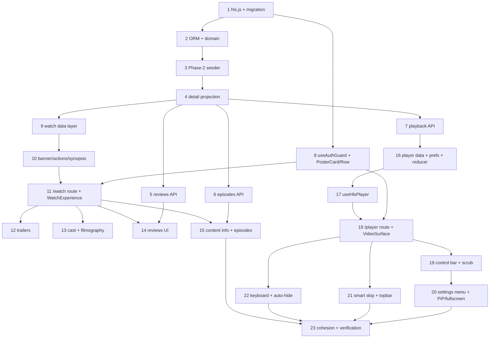

# Implementation Plan

## Overview

Each task is < 45 min, ends in something visible/testable, is in dependency order, names the files it touches, and **never modifies a Phase-1 homepage file**. Backend tasks come first so the frontend has real data to bind to.

## Tasks

- [ ] 1. Add the `hls.js` dependency and a tiny additive DB migration helper
  - Modify `frontend/package.json` (add `hls.js` + `@types`), run install.
  - Create `backend/infrastructure/database/migrations.py` → `ensure_content_columns(engine)` (adds missing JSON/TEXT columns to `content` via `PRAGMA table_info` + `ALTER TABLE ADD COLUMN`).
  - **Done when:** `hls.js` resolves in the frontend (typecheck passes) and a one-off backend run of `ensure_content_columns()` adds the new columns to the existing SQLite DB without data loss (verified via `PRAGMA table_info(content)`).
  - _Requirements: 14.5, 10.2_

- [ ] 2. Extend ORM + domain models for Phase-2 data
  - Modify `backend/infrastructure/database/models.py` (new `content` columns; new `ReviewORM`, `EpisodeORM`).
  - Create `backend/domain/review.py` (Review entity); extend `backend/domain/content.py` dataclasses (Trailer, CastMember, ContentInfo, SkipMarker).
  - Wire `ensure_content_columns()` + `create_all` into `main.py` lifespan.
  - **Done when:** backend boots, `reviews` and `episodes` tables exist, and `GET /api/v1/content/home` still returns 200 (no regression).
  - _Requirements: 14.1, 14.4, 14.5_

- [ ] 3. Phase-2 seeder (backfill columns + reviews + episodes)
  - Create `backend/infrastructure/content/seed_phase2.py` → `backfill_and_seed(session)`; call it in lifespan after seeding.
  - **Done when:** after a fresh boot, a seeded title row has non-null `hls_url`/`cast`/`content_info`/`skip_markers`, the `reviews` table has rows, and series titles have `episodes` rows (verified via a quick query/log line "Phase2 backfilled N titles, M reviews, K episodes").
  - _Requirements: 14.1–14.5_

- [ ] 4. Extend content detail projection + service
  - Modify `backend/application/services/content_service.py` (`_detail` adds trailers, cast, content_info, rating_breakdown computed from reviews).
  - **Done when:** `GET /api/v1/content/signal-horizon` returns the new fields and existing tests still pass.
  - _Requirements: 14.1_

- [ ] 5. Reviews service + endpoints
  - Create `backend/application/services/review_service.py`; add `GET /content/{id}/reviews?sort=` and `POST /content/{id}/reviews/{rid}/vote` to `backend/interface/api/content.py`.
  - Create `backend/tests/test_reviews.py`.
  - **Done when:** reviews endpoint returns breakdown+items, sorting works, a vote increments the counter, 404 on bad id; `pytest` green.
  - _Requirements: 8.1–8.6, 14.2_

- [ ] 6. Episodes service + endpoint
  - Create `backend/application/services/episode_service.py`; add `GET /content/{id}/episodes`.
  - Create `backend/tests/test_episodes.py`.
  - **Done when:** series title returns seasons→episodes, movie returns empty seasons; `pytest` green.
  - _Requirements: 6.1, 14.4_

- [ ] 7. Playback service + endpoint
  - Create `backend/application/services/playback_service.py`; add `GET /content/{id}/playback?ep=`.
  - Create `backend/tests/test_playback.py`.
  - **Done when:** returns `hls_url`, renditions, audio/subtitle tracks, skip_markers, next_episode_id; 404 on bad id; `pytest` green (full backend suite passes).
  - _Requirements: 10.1, 12.1–12.3, 14.3_

- [ ] 8. Shared `useAuthGuard` hook + `PosterCard`/`PosterRow`
  - Create `frontend/src/shared/hooks/useAuthGuard.ts` (better-auth session → redirect `/login`, lenient in dev).
  - Create `frontend/src/shared/components/PosterCard.tsx` and `PosterRow.tsx` (visually match home card; navigate to `/watch/[id]`).
  - **Done when:** typecheck passes; a temporary throwaway render of `PosterRow` shows cards (verified on the watch page in Task 11). No homepage file touched.
  - _Requirements: 7.1, 7.3, 15.1, 15.2_

- [ ] 9. Watch feature data layer (api + types + hooks)
  - Create `frontend/src/features/watch/{api.ts,types.ts,hooks.ts}`.
  - **Done when:** `tsc --noEmit` passes and the hooks compile against the live endpoints (types mirror the API contract).
  - _Requirements: 1.1, 14.1, 14.2, 14.4_

- [ ] 10. Watch banner + actions + synopsis
  - Create `WatchBanner.tsx`, `WatchActions.tsx`, `SynopsisBlock.tsx` in `features/watch/components/`.
  - **Done when:** rendered in isolation they show poster/blurred backdrop, badges, ratings, Play/Watchlist/Share, and expandable synopsis (wired fully in Task 11).
  - _Requirements: 2.1–2.5, 3.1–3.5_

- [ ] 11. Assemble `/watch/[id]` route + `WatchExperience` (banner + actions + synopsis + related)
  - Create `frontend/src/app/watch/[id]/page.tsx` and `features/watch/WatchExperience.tsx`; create `RelatedRows.tsx` (uses `PosterRow`).
  - **Done when:** visiting `/watch/signal-horizon` shows the banner, working Watchlist/Share, expandable synopsis, a "More Like This" row, skeletons while loading, and a styled 404 for a bad id. Play navigates toward `/player/[id]` (player built later).
  - _Requirements: 1.1–1.6, 2.x, 3.x, 7.x, 15.1, 15.3_

- [ ] 12. Trailers row + inline player
  - Create `TrailersRow.tsx`, `InlineTrailerPlayer.tsx`; mount in `WatchExperience`.
  - **Done when:** on `/watch/signal-horizon` the trailers row scrolls and selecting one plays inline with a PiP control; section hidden when no trailers.
  - _Requirements: 4.1–4.4_

- [ ] 13. Cast row + filmography side panel
  - Create `CastRow.tsx`, `FilmographyPanel.tsx`; mount in `WatchExperience`.
  - **Done when:** cast row scrolls; clicking a member opens a side panel of their other titles; panel closes via button/backdrop/Esc.
  - _Requirements: 5.1–5.4_

- [ ] 14. Reviews section (breakdown + cards + voting + spoiler + sort)
  - Create `Reviews.tsx`, `RatingBreakdown.tsx`, `ReviewCard.tsx`; mount in `WatchExperience`.
  - **Done when:** breakdown bar chart renders, reviews list, verified badge shows, Helpful vote updates the count (persists via API), spoiler toggle hides/reveals, sort changes order.
  - _Requirements: 8.1–8.6_

- [ ] 15. Content info panel + episode list
  - Create `ContentInfoPanel.tsx`, `EpisodeList.tsx`; mount in `WatchExperience`.
  - **Done when:** info panel shows languages/subtitles/accessibility/warning/studio/clickable genres; for a series (`crown-of-ash`) the episode list shows season tabs + episodes with watched markers; movies omit it.
  - _Requirements: 6.1–6.4, 9.1–9.4_

- [ ] 16. Player data layer + prefs store + reducer
  - Create `features/player/{api.ts,types.ts,reducer.ts}` and `features/player/store/player-prefs.ts`.
  - **Done when:** `tsc --noEmit` passes; reducer + prefs store compile and are unit-reasoned (pure helpers for clamp/skip/label included).
  - _Requirements: 10.1, 11.x, 13.x_

- [ ] 17. `useHlsPlayer` hook (core HLS integration)
  - Create `features/player/hooks/useHlsPlayer.ts`.
  - **Done when:** given a `videoRef` and `hls_url`, video loads via hls.js (or native on Safari), exposes levels/active level, audio/subtitle tracks, and recovers from a forced error; verified by the minimal player in Task 18.
  - _Requirements: 10.2, 10.3, 10.4, 11.6, 11.7, 11.8_

- [ ] 18. `/player/[id]` route + `PlayerExperience` + `VideoSurface` (minimal playable)
  - Create `frontend/src/app/player/[id]/page.tsx`, `features/player/PlayerExperience.tsx`, `components/VideoSurface.tsx`, `components/PlayerError.tsx`.
  - **Done when:** clicking Play on `/watch/signal-horizon` opens `/player/signal-horizon` and the sample stream **plays** with a buffering spinner and error/retry overlay; auth-guard redirects when logged out.
  - _Requirements: 10.1–10.5, 15.2_

- [ ] 19. Control bar + scrub bar (with hover thumbnail preview)
  - Create `components/ControlBar.tsx`, `components/ScrubBar.tsx`; mount in `PlayerExperience`.
  - **Done when:** custom play/pause, time/duration, volume+mute, and a scrub bar with played/buffered fill work; hovering the bar shows a time tooltip + thumbnail frame (fallback to time-only). No native controls visible.
  - _Requirements: 11.1–11.4_

- [ ] 20. Settings menu (speed, quality, subtitles, audio) + PiP/fullscreen/mini-player
  - Create `components/SettingsMenu.tsx`; add PiP/fullscreen/mini-player buttons to `ControlBar`.
  - **Done when:** speed 0.5x–2x changes playback rate; quality menu lists Auto + manifest levels and switching works (active level shown); subtitle + audio selectors toggle tracks; PiP, fullscreen, and mini-player function.
  - _Requirements: 11.5, 11.6, 11.7, 11.8, 11.9, 11.10_

- [ ] 21. Smart Skip buttons + TopBar (title/back/cinematic)
  - Create `components/SmartSkipButtons.tsx`, `components/TopBar.tsx`; mount in `PlayerExperience`.
  - **Done when:** "Skip Intro" appears only within the seeded intro interval and seeks to its end; "Next Episode" appears near credits (routes to next episode for series); TopBar shows title/back and toggles cinematic mode.
  - _Requirements: 12.1–12.4, 13.4_

- [ ] 22. Keyboard shortcuts + double-tap seek + controls auto-hide
  - Create `features/player/hooks/usePlayerKeyboard.ts`, `useControlsVisibility.ts`; wire into `PlayerExperience` and `VideoSurface`.
  - **Done when:** Space/M/F/C and arrow keys work (not while typing), double-tap/double-click seeks ±10s, controls auto-hide on inactivity and reappear on activity, Esc exits cinematic/fullscreen.
  - _Requirements: 13.1–13.5, 11.10_

- [ ] 23. Final cohesion + verification pass
  - Cross-check theme/responsiveness/reduced-motion on both routes; ensure no Phase-1 homepage file changed (git diff scope check); run full backend `pytest` + frontend `tsc`.
  - **Done when:** both routes look native to the platform on mobile/desktop, all backend tests pass, typecheck clean, homepage untouched, and a short manual smoke checklist (Play→watch→play, quality/subtitle/audio switch, Skip Intro, keyboard) passes.
  - _Requirements: 15.1, 15.3, 15.4, 15.5, 16.1, 16.2, 16.3_

## Task Dependency Graph



```json
{
  "waves": [
    { "wave": 1, "tasks": [1], "rationale": "Dependency + migration helper; unblocks all backend and the hls.js frontend." },
    { "wave": 2, "tasks": [2], "rationale": "ORM/domain models depend on the migration helper." },
    { "wave": 3, "tasks": [3], "rationale": "Seeder depends on the new tables/columns." },
    { "wave": 4, "tasks": [4, 8], "rationale": "Detail projection needs seeded data; shared auth/PosterCard only needs hls.js task done." },
    { "wave": 5, "tasks": [5, 6, 7, 9], "rationale": "Reviews/episodes/playback APIs and watch data layer all build on the detail projection." },
    { "wave": 6, "tasks": [10], "rationale": "Banner/actions/synopsis build on the watch data layer." },
    { "wave": 7, "tasks": [11], "rationale": "Watch route assembles banner + auth guard + related (PosterRow)." },
    { "wave": 8, "tasks": [12, 13, 14, 15, 16], "rationale": "Watch sub-sections + player data layer; independent of each other." },
    { "wave": 9, "tasks": [17], "rationale": "HLS hook depends on player data layer." },
    { "wave": 10, "tasks": [18], "rationale": "Player route mounts the HLS hook + auth guard." },
    { "wave": 11, "tasks": [19, 21, 22], "rationale": "Control bar, smart skip, keyboard all build on the playable player." },
    { "wave": 12, "tasks": [20], "rationale": "Settings menu builds on the control bar." },
    { "wave": 13, "tasks": [23], "rationale": "Final cohesion + verification across everything." }
  ]
}
```

## Notes

- **Backend-first ordering:** Tasks 1–7 land real data/endpoints so every frontend task binds to live responses (no orphaned UI, no mocks to rip out later).
- **Homepage freeze:** No task edits any file under `features/home` or the existing homepage components. Task 23 includes a git-diff scope check to enforce this.
- **Reused Phase-1 primitives:** `Skeleton`/`SkeletonRow`, `EmptyState`, `Button`, `glass`/accent tokens, and `MomentumRow`-style interaction are reused for visual cohesion; related rows use the new shared `PosterCard`/`PosterRow` (Task 8) rather than home internals.
- **No new libraries except `hls.js`** (Task 1). Schema changes are additive only (`ensure_content_columns`).
- **Sample HLS:** Mux multi-rendition test stream is the `hls_url` until a real encoder exists; the data contract is encoder-ready so swapping in real manifests is a data-only change.
- **Verifiable checkpoints:** backend tasks end in `pytest` green; frontend tasks end in a concrete on-screen result at `/watch/signal-horizon` (movie) or `/watch/crown-of-ash` (series) and `/player/signal-horizon`.
